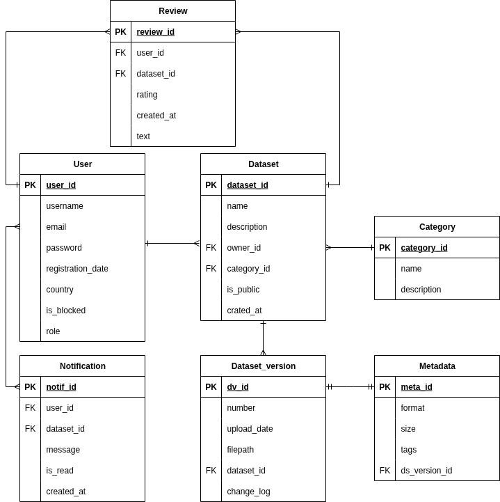
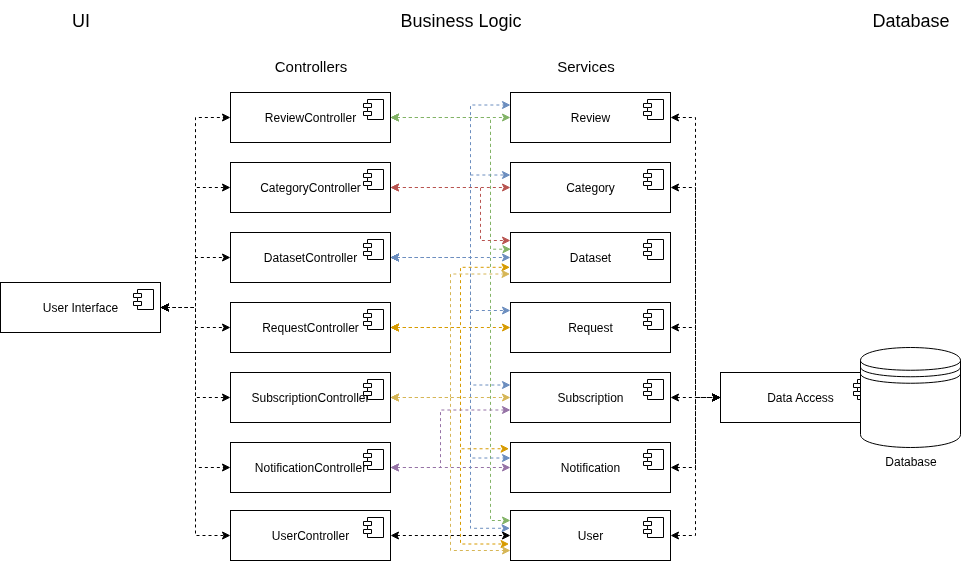
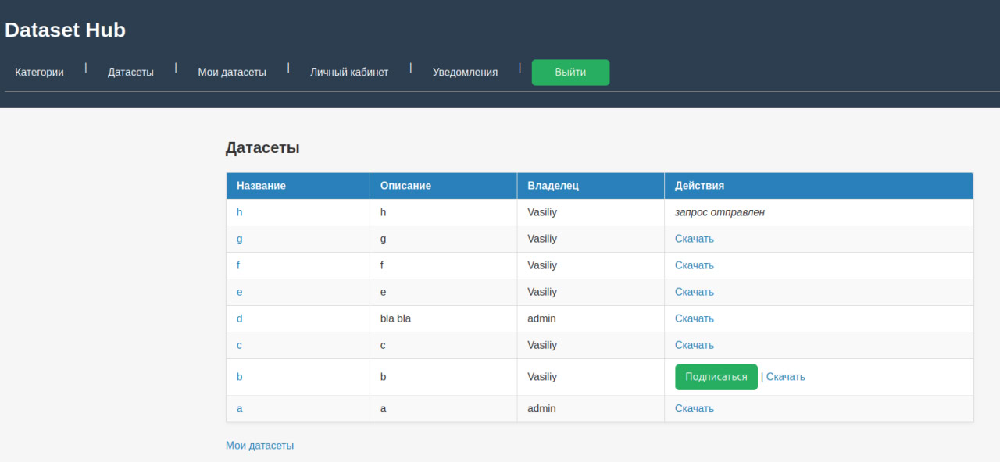

# Сервис хранения и каталогизации датасетов для ML

## Описание идеи проекта

Проект представляет собой веб-приложение для удобного хранения, каталогизации и управления версиями наборов данных (
датасетов), предназначенных для машинного обучения и анализа данных. Сервис позволит пользователям загружать и скачивать
датасеты, добавлять метаданные и оценивать понравившиеся наборы данных.

## Описание предметной области

Проект ориентирован на область работы с наборами данных (датасетами), используемыми в машинном обучении и аналитике
данных. Пользователи сталкиваются с проблемами хранения, организации и поддержки актуальности датасетов, особенно при
частых обновлениях информации.

## Цель и предоставляемые возможности

- **Цель**: создать единое пространство для публикации, версионирования и совместного использования ML-датасетов с
  прозрачной историей изменений.
- **Решаемая проблема**: отсутствие удобного механизма обновления и категоризации наборов данных в командах, что ведёт к
  использованию устаревших версий.
- **Предоставляемая возможность**: автоматизированное управление версиями, уведомления подписчиков, сбор обратной связи
  и единая точка доступа к файлам и метаданным.

## Анализ аналогичных решений

| Критерий                            | Kaggle | HuggingFace | UCI Repository | ClearML | Мое решение |
|-------------------------------------|--------|-------------|----------------|---------|-------------|
| Версионность датасетов              | Нет    | Есть        | Нет            | Есть    | Есть        |
| Публичные датасеты                  | Есть   | Есть        | Есть           | Нет     | Есть        |
| Отзывы и оценки                     | Есть   | Нет         | Есть           | Нет     | Есть        |
| Напоминания об обновлении датасетов | Нет    | Нет         | Нет            | Есть    | Есть        |

## Функциональные требования

- Каталогизация датасетов по категориям.
- Версионирование датасетов и хранение связанных файлов в S3-совместимом хранилище.
- Управление доступом и подписками пользователей на обновления наборов данных.
- Создание и модерация отзывов, подсчёт рейтингов и уведомления подписчиков.
- REST API с документированной схемой (Swagger) и серверным web-интерфейсом.
- Логирование действий и ведение аудита для администраторов.

## Обоснование целесообразности и актуальности проекта

Актуальность данного проекта обусловлена растущим спросом на удобные инструменты для работы с датасетами в области
анализа данных и машинного обучения. Большинство существующих платформ не предоставляют пользователям механизма
напоминаний о своевременном обновлении наборов данных, так как ориентированы скорее на пассивное хранение или на
активность самих пользователей, что может привести к использованию устаревших данных и снижению качества исследований и
моделей.

## Краткое описание акторов

В проекте выделены следующие акторы:

* Гость – неавторизованный пользователь, который имеет возможность просматривать публичные датасеты и их метаданные а
  также скачивать их.

* Авторизованный пользователь – пользователь, прошедший процедуру регистрации и авторизации. Может загружать собственные
  датасеты, редактировать их метаданные, создавать новые версии.

* Администратор – обладает полными правами для управления всеми датасетами, метаданными, а также управляет правами
  доступа других пользователей, модерирует контент и контролирует работу системы.

## Use-case диаграмма


## BPMN диаграммы бизнес-процессов

- Публикация датасета с модерацией  
  

- Запрос доступа и уведомление владельца  
  

- Обновление версии и рассылка оповещений  
  

## Основные пользовательские сценарии

### Сценарий 1: Просмотр публичных датасетов (Гость)

1) Гость заходит на главную страницу приложения.

2) Система отображает список доступных публичных датасетов.

3) Гость выбирает интересующий датасет.

4) Система показывает подробные метаданные выбранного датасета.

### Сценарий 2: Загрузка датасета авторизованным пользователем

1) Пользователь авторизуется в системе.

2) Пользователь нажимает кнопку «Загрузить датасет».

3) Пользователь загружает файлы и вводит метаданные.

4) Система автоматически создает новую версию датасета и сохраняет метаданные.

### Сценарий 3: Добавление отзыва к датасету

1) Пользователь назодит датасет и открывает страницу с ним.

2) Пользователь выбирает опцию «Оставить отзыв».

3) Пользователь вводит текст отзыва.

4) Пользователь выбирает опцию «Опубликовать».

5) Система сохраняет отзыв, связывая его с текущим пользователем и выбранным датасетом.

6) Отзыв появляется на странице датасета.

## ER-диаграмма сущностей


## Диаграмма базы данных




## Технологический стек

- Backend: Go 1.21+, фреймворки chi, zap, dockertest, minio-go, swagger.
- Frontend: SPA, TypeScript.
- База данных: PostgreSQL 15, миграции на golang-migrate.
- Хранилище файлов: MinIO (S3 API).

## Компонентная диаграмма



## Черновые экраны web-приложения



## Тестирование и Allure-отчет

### Запуск юнит-тестов

Все юнит-тесты выполняются стандартной командой:

```bash
go test ./...
```

### Генерация Allure-результатов

```bash
make test-dataset-allure
```

Отчет можно собрать командой:

```bash
make allure-report
```

### E2E-тесты

E2E сценарии теперь работают только поверх реального HTTP-приложения.

1. Поднимите окружение (Postgres + Mongo + MinIO + API):
   ```bash
   docker compose up -d --build db mongo minio api
   ```
2. Выполните тесты, указав базовый URL приложения (по умолчанию `http://localhost:8080`):
   ```bash
   E2E_BASE_URL=http://localhost:8080 make test TEST_PHASE=e2e
   ```

Если сервис или инфраструктура недоступны, тест немедленно завершится ошибкой соединения. Для ручной проверки и демонстрации трафика используйте Postman-коллекцию `docs/postman/public_dataset_journey.postman_collection.json` вместе с инструкцией `docs/e2e_capture.md` (Wireshark/tcpdump).

### Быстрый запуск тестов

## Асинхронный шлюз и маршрутизация

Для маршрутизации REST API, legacy-интерфейса и статических страниц добавлен асинхронный шлюз на базе Nginx.
Шлюз собирается из директории `deploy/nginx` и разворачивается вместе с API, GUI и вспомогательными
сервисами командой:

```bash
docker compose up --build nginx
```

Команда автоматически поднимет PostgreSQL, MongoDB, MinIO, сервис API (`cmd/api`), Tech UI (`MODE=gui`),
Adminer и сам шлюз (листен `localhost:8088`). Все конфигурации сервисов переопределяются через переменные
окружения, благодаря чему контейнеры используют сетевые имена (`db`, `mongo`, `minio`).

### Настроенные маршруты шлюза

| Путь             | Назначение                                                                 |
|------------------|----------------------------------------------------------------------------|
| `/`              | Приветственная страница SPA с эскизами будущего интерфейса (`static/index`)|
| `/reserved/`     | Резервная точка, отдаёт ту же статику что и `/`                             |
| `/managment`     | HTML-панель с быстрыми ссылками на все служебные страницы                  |
| `/api/v1`        | Swagger UI (v1) поверх `swagger/doc.json`, дальше маршрутизация в Go API   |
| `/api/v2`        | Swagger UI (v2) поверх `/api/v2/openapi.yaml`, дальше маршрутизация в Go API|
| `/legacy`        | Прокси в существующий Tech UI (`MODE=gui`, порт 8090)                      |
| `/admin`         | Прокси в Adminer, сразу после логина открывает доступ к PostgreSQL         |
| `/documentation` | Отдаёт `readme.md` (WebLab#1) с типом `text/markdown`                      |
| `/status`        | Встроенный `stub_status` со статистикой Nginx                              |

Swagger-страницы используют CDN `swagger-ui-dist` и работают асинхронно: корень (`/api/v1`, `/api/v2`)
отдаёт HTML, а любые вложенные маршруты (например, `/api/v2/datasets`) проксируются к сервису `api`. Для
сохранения обратной совместимости путь `/swagger/**` также проксируется к Go-приложению.

### Статические артефакты

Все статические файлы располагаются в `static/` и автоматически копируются в образ шлюза. Галерея на `/`
использует изображения из WebLab#1 (`static/img/`), а страница `/documentation` читает актуальный `readme.md`.
При необходимости добавить дополнительные страницы достаточно положить их в `static/` и обновить `nginx.conf`.

- Юнит-тесты: `make test-unit` (или `make test TEST_PHASE=unit`)
- Интеграционные тесты: `make test-integration`
- E2E-сценарий: `make test-e2e`
- Allure-отчет (unit + integration + e2e): `make allure-report`
