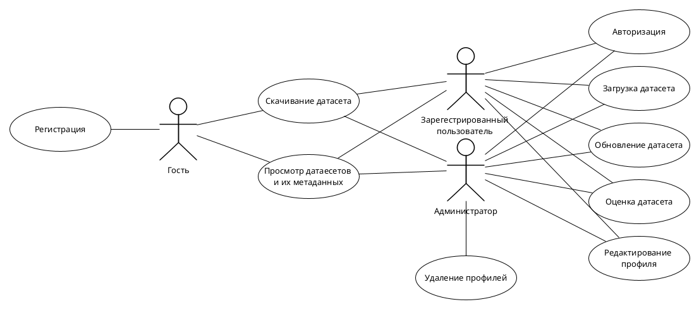
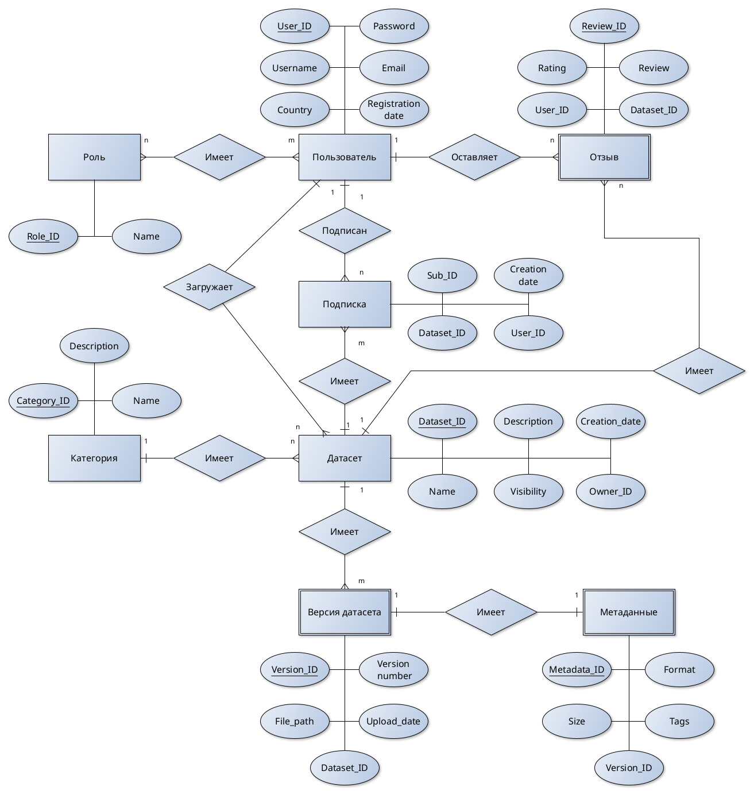
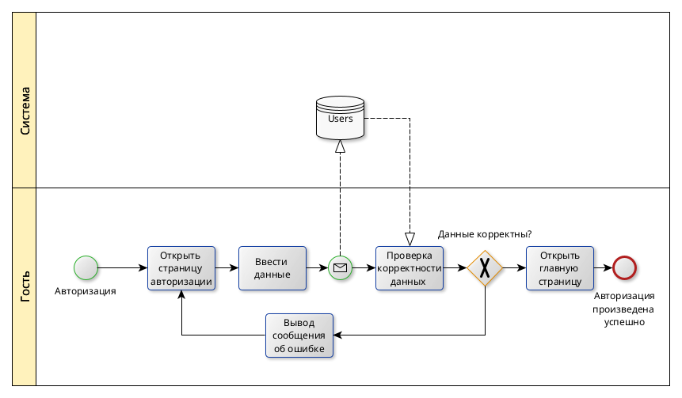
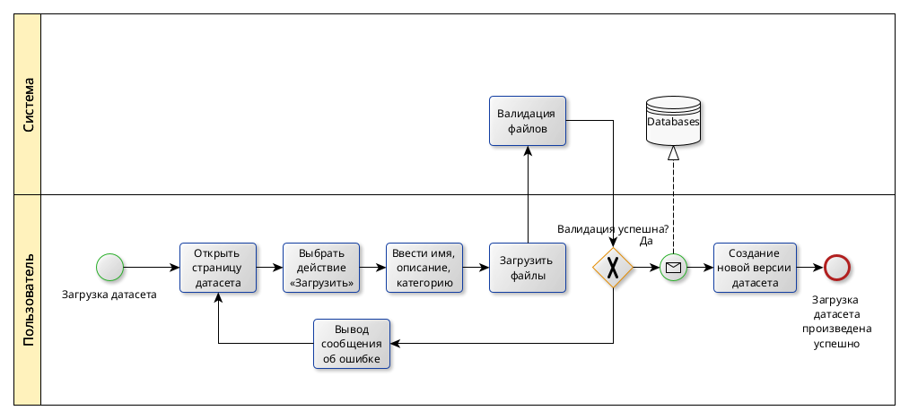
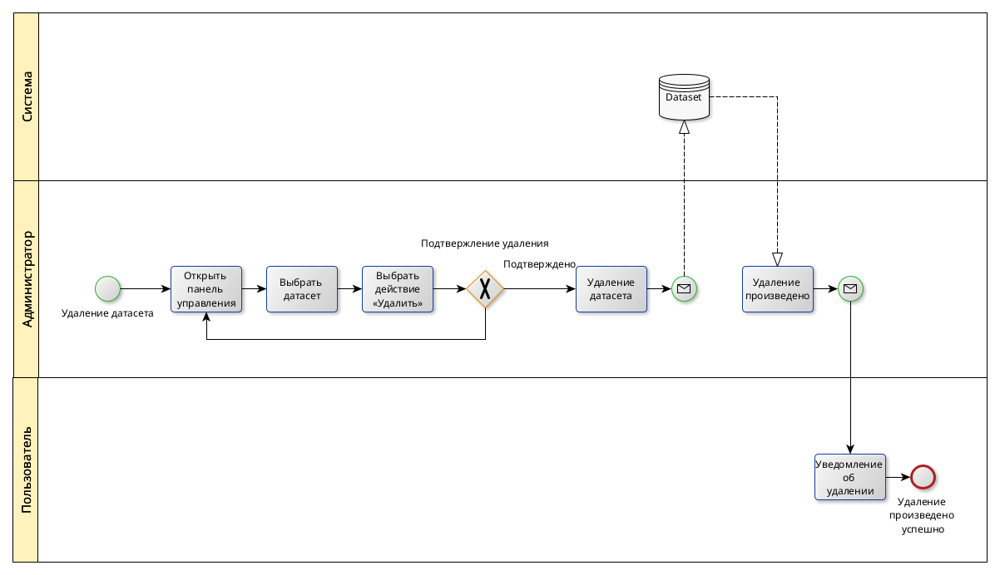
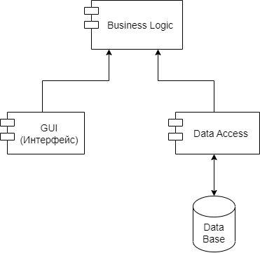
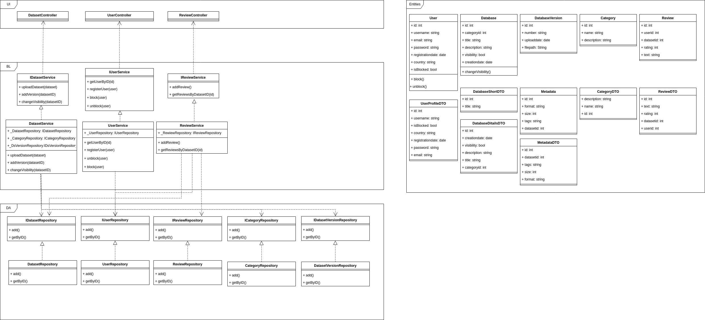

# Сервис хранения и каталогизации датасетов для ML

## Описание идеи проекта

Проект представляет собой веб-приложение для удобного хранения, каталогизации и управления версиями наборов данных (датасетов), предназначенных для машинного обучения и анализа данных. Сервис позволит пользователям загружать и скачивать датасеты, добавлять метаданные и оценивать понравившиеся наборы данных.

## Описание предметной области

Проект ориентирован на область работы с наборами данных (датасетами), используемыми в машинном обучении и аналитике данных. Пользователи сталкиваются с проблемами хранения, организации и поддержки актуальности датасетов, особенно при частых обновлениях информации. 

## Анализ аналогичных решений

|Критерий|Kaggle|HuggingFace|UCI Repository|ClearML|Мое решение|
|-|-|-|-|-|-|
|Версионность датасетов|Нет|Есть|Нет|Есть|Есть|
|Предпросмотр данных|Есть|Есть|Нет|Есть|Есть|
|Отзывы и оценки|Есть|Нет|Есть|Нет|Есть|
|Напоминания об обновлении датасетов|Нет|Нет|Нет|Есть|Есть|

## Обоснование целесообразности и актуальности проекта

Актуальность данного проекта обусловлена растущим спросом на удобные инструменты для работы с датасетами в области анализа данных и машинного обучения. Большинство существующих платформ не предоставляют пользователям механизма напоминаний о своевременном обновлении наборов данных, так как ориентированы скорее на пассивное хранение или на активность самих пользователей, что может привести к использованию устаревших данных и снижению качества исследований и моделей. 

## Краткое описание акторов

В проекте выделены следующие акторы:

* Гость – неавторизованный пользователь, который имеет возможность просматривать публичные датасеты и их метаданные а также скачивать их.

* Авторизованный пользователь – пользователь, прошедший процедуру регистрации и авторизации. Может загружать собственные датасеты, редактировать их метаданные, создавать новые версии.

* Администратор – обладает полными правами для управления всеми датасетами, метаданными, а также управляет правами доступа других пользователей, модерирует контент и контролирует работу системы.


## Use-Case



## ER-диаграмма сущностей



## Пользовательские сценарии

### Сценарий 1: Просмотр публичных датасетов (Гость)

1) Гость заходит на главную страницу приложения.

2) Система отображает список доступных публичных датасетов.

3) Гость выбирает интересующий датасет.

4) Система показывает подробные метаданные выбранного датасета.

### Сценарий 2: Загрузка датасета авторизованным пользователем

1) Пользователь авторизуется в системе.

2) Пользователь нажимает кнопку «Загрузить датасет».

3) Пользователь загружает файлы и вводит метаданные.

4) Система автоматически создает новую версию датасета и сохраняет метаданные.

### Сценарий 3: Добавление отзыва к датасету

1) Пользователь назодит датасет и открывает страницу с ним.

2) Пользователь выбирает опцию «Оставить отзыв».

3) Пользователь вводит текст отзыва.

4) Пользователь выбирает опцию «Опубликовать».

5) Система сохраняет отзыв, связывая его с текущим пользователем и выбранным датасетом.

6) Отзыв появляется на странице датасета.

## Формализация бизнес процессов







## Технолоический стек

* Тип приложения - Web MPA.
* Язык разработки - Go
* БД - postqbuildQL
* Хранилище датасетов - S3

## Верхнеуровневое разбиение на компоненты



## Диаграмма классов



## Тестирование и Allure-отчет

### Запуск юнит-тестов

Все юнит-тесты выполняются стандартной командой:

```bash
go test ./...
```

### Генерация Allure-результатов

```bash
make test-dataset-allure
```

Отчет можно собрать командой:

```bash
make allure-report
```

По умолчанию `make test-dataset-allure` выполняет `go test` с параметрами `-shuffle=on` и `-p 1`. Поведение `go test` по количеству процессов управляется флагом `-p`. 

### Паттерны в тестах

Тестовые данные собираются через builder'ы и `Fabric`. Для каждого публичного метода основного сервиса предусмотрены позитивные и негативные сценарии.


